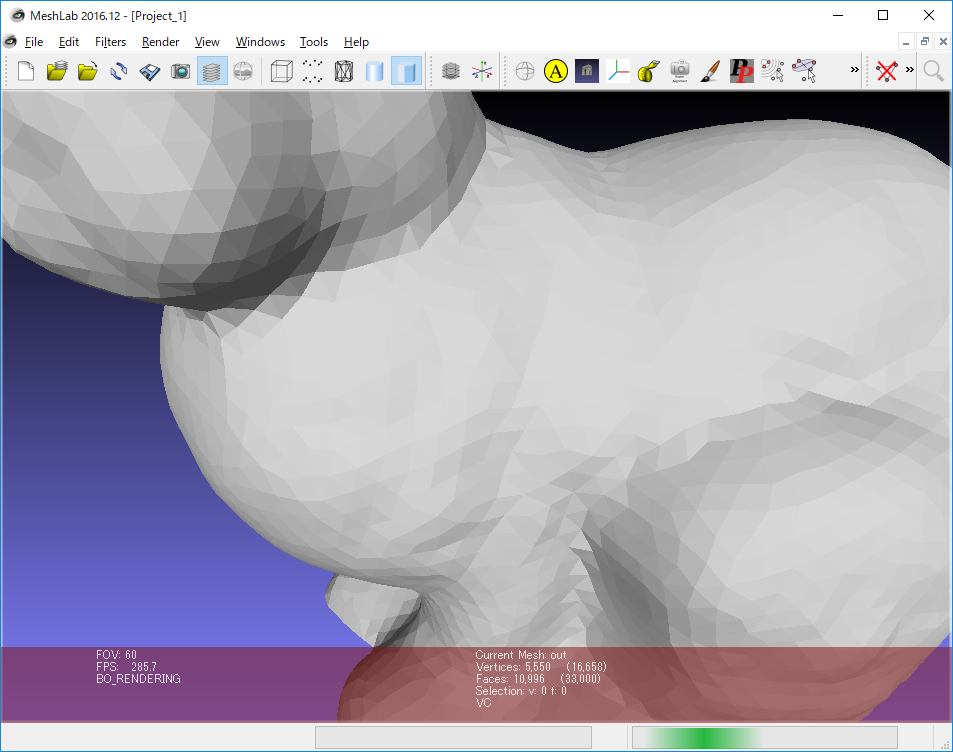
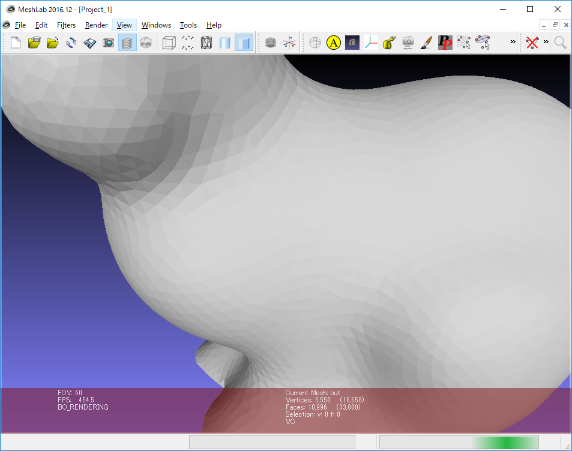

# OpenMesh_samples
OpenMesh basic usage

# 概要

公式サイト

- [OpenMesh]([https://www.openmesh.org](https://www.openmesh.org/))
- [OpenMesh / OpenMesh · GitLab](https://graphics.rwth-aachen.de:9000/OpenMesh/OpenMesh)

参考サイト

- [オープンソースの３Dメッシュデータライブラリ『OpenMesh』 | NegativeMindException](https://blog.negativemind.com/2015/11/18/openmesh/)
- [OpenMeshの使い方 - Qiita](https://qiita.com/shohirose/items/d92447fcc07a623ebf24)
- [OpenMesh | 研究開発日誌](http://www.cloud.teu.ac.jp/public/MDF/toudouhk/blog/2015/04/10/OpenMesh/)

オープンソースの3Dメッシュデータ用ライブラリ。Python版もある。

OpenFlipperというソフトはOpenMeshをベースに作成されている。

# 環境構築

## インストーラーを使用する場合

OpenMeshのGitLabのリンク(https://www.graphics.rwth-aachen.de:9000/OpenMesh/OpenMesh#download-binaries)からインストーラーをダウンロードして実行する。

この方法ではリリース版のライブラリしかインストールされない。

## ソースからビルドする場合

cmakeとQtが無い場合は先にインストールしておくこと。

Qtは使用するコンパイラのbinのパスを通しておくとcmakeが自動で見つけてくれる。

ソースを任意のフォルダにクローンする。

```
C:\Users\nitta\Documents\GitLab>git clone https://www.graphics.rwth-aachen.de:9000/OpenMesh/OpenMesh.git
Cloning into 'OpenMesh'...
remote: Enumerating objects: 19584, done.
remote: Counting objects: 100% (19584/19584), done.
remote: Compressing objects: 100% (5235/5235), done.
remote: Total 19584 (delta 14114), reused 19502 (delta 14071)
Receiving objects: 100% (19584/19584), 9.15 MiB | 454.00 KiB/s, done.
Resolving deltas: 100% (14114/14114), done.
Checking out files: 100% (567/567), done.
```

クローンしたフォルダに移動し、build用のフォルダを作成、build内でcmakeコマンドを実行する。コンパイラは適当なもの(ここではVisual Studio 2017)を指定する。

```
C:\Users\nitta\Documents\GitLab>cd OpenMesh

C:\Users\nitta\Documents\GitLab\OpenMesh>md build

C:\Users\nitta\Documents\GitLab\OpenMesh>cd build

C:\Users\nitta\Documents\GitLab\OpenMesh\build>cmake .. -G"Visual Studio 15 2017 Win64"
-- Selecting Windows SDK version 10.0.17763.0 to target Windows 10.0.17134.
-- The C compiler identification is MSVC 19.16.27031.1
-- The CXX compiler identification is MSVC 19.16.27031.1
-- Check for working C compiler: C:/Program Files (x86)/Microsoft Visual Studio/2017/Community/VC/Tools/MSVC/14.16.27023/bin/Hostx86/x64/cl.exe
-- Check for working C compiler: C:/Program Files (x86)/Microsoft Visual Studio/2017/Community/VC/Tools/MSVC/14.16.27023/bin/Hostx86/x64/cl.exe -- works
-- Detecting C compiler ABI info
-- Detecting C compiler ABI info - done
-- Detecting C compile features
-- Detecting C compile features - done
-- Check for working CXX compiler: C:/Program Files (x86)/Microsoft Visual Studio/2017/Community/VC/Tools/MSVC/14.16.27023/bin/Hostx86/x64/cl.exe
-- Check for working CXX compiler: C:/Program Files (x86)/Microsoft Visual Studio/2017/Community/VC/Tools/MSVC/14.16.27023/bin/Hostx86/x64/cl.exe -- works
-- Detecting CXX compiler ABI info
-- Detecting CXX compiler ABI info - done
-- Detecting CXX compile features
-- Detecting CXX compile features - done
-- Found OpenGL: opengl32
-- Could NOT find Doxygen (missing: DOXYGEN_EXECUTABLE)

************************************************************
* ACG Buildsystem                                          *
*                                                          *
* Package : OpenMesh                                       *
* Version : 8.1                                            *
************************************************************
-- Configuring done
-- Generating done
-- Build files have been written to: C:/Users/nitta/Documents/GitLab/OpenMesh/build
```

一度cmakeのguiを起動し、オプションの設定を行う。

```
C:\Users\nitta\Documents\GitLab\OpenMesh\build>cmake-gui ..
```

必要なら以下の設定を変更する。

| 設定項目              | デフォルト値 |説明|
| --------------------- | ---- |---|
| OPENMESH_BUILD_SHARED | OFF |ON:DLL形式でビルドする|
|CMAKE_INSTALL_PREFIX|C:/Program Files/OpenMesh|ビルドファイルのインストールディレクトリ|

設定を変更した場合はgui上でgenerateを実行する。

コンパイラで指定したvisual studio 2017を管理者権限で起動して、`./build/OpenMesh.sln`ファイルを開く。

DebugとReleaseでコンパイルしたい方を選択(両方必要ならモード切り替えて再度同じ手順で実行する)し、ソリューションエクスプローラーでALL_INSTALLを選択。

メニューのビルド$\rightarrow$ALL_BUILDのビルドを実行。cmakeの設定に問題が無ければ、以下の出力が出てくる

```
========== ビルド: 18 正常終了、0 失敗、0 更新不要、0 スキップ ==========
```

その後、INSTALLを選択し、メニューのビルド$\rightarrow$INSTALLのビルドを実行。以下の出力になる。

```
========== ビルド: 2 正常終了、0 失敗、17 更新不要、0 スキップ ==========
```

./build/Build内にサンプルの実行ファイルがいくつか生成される。

---

# サンプルファイル

### CMakeLists.txt構成

- ./general.cmakeに共通の設定をして、各プロジェクトのCMakeLists.txt内でinclude()している。
- 実行ファイルはプロジェクトフォルダ名と同じ名前で./binにすべて出力される。
- デバッグモードの場合は末尾にdが付加される。
- 新規でプロジェクトを作成する場合は./templateフォルダをコピーしてリネームして使うとよい。
  - ./tamplate/CMakeLists_all_in_one.txtは不要なので削除してもよい(include()を使用しない場合のサンプル)

## tutorial_001_BuildingCube

https://www.openmesh.org/media/Documentations/OpenMesh-Doc-Latest/a04088.html


公式サイトのチュートリアル最初のサンプル(https://www.openmesh.org/media/Documentations/OpenMesh-Doc-Latest/a04088.html)

CMakeLists.txtはチュートリアルではgitファイル内で使う方法しか書かれてないようだったため、新規で作成。

必要な箇所だけ抜粋すると以下のようになる。

```cmake:CMakeLists.txt
cmake_minimum_required( VERSION 3.6 )

# Create Project
get_filename_component(ProjectId ${CMAKE_CURRENT_SOURCE_DIR} NAME) # https://stackoverflow.com/questions/12344368/automatically-use-the-directory-as-the-project-name-in-cmake
string(REPLACE " " "_" ProjectId ${ProjectId})
project(${ProjectId} CXX)

add_compile_options("$<$<CXX_COMPILER_ID:MSVC>:/utf-8>")

# Find OpenMesh Package
set( OpenMesh_ROOT "C:/Program Files/OpenMesh")
find_package( OpenMesh REQUIRED )

set(SOURCE_FILES
   main.cpp
)
set(TARGET_LINK_LIBRARIES
   OpenMeshCore
   OpenMeshTools
)
# Add Executable
add_executable(${PROJECT_NAME} ${SOURCE_FILES})

# Preprocessor Definitions
add_definitions(-D_USE_MATH_DEFINES) # Core/System/compiler.hhで定義が無いとエラーになる
target_link_libraries(${PROJECT_NAME} ${TARGET_LINK_LIBRARIES})

```

OpenMeshCoreとOpenMeshToolsにincludeパスとlibの設定がされている(`C:\Program Files\OpenMesh\share\OpenMesh\cmake\OpenMeshConfig.cmake`)ので、target_link_librariesだけで設定が完了する。

実行すると、立方体形状のoffファイルを生成する。

## tutorial_002_Iterators_Circulators

https://www.openmesh.org/media/Documentations/OpenMesh-Doc-Latest/a04089.html

|スムージング前|スムージング後|
|---|---|
|||

全ての頂点について隣接するすべての頂点の座標平均を取り、そこに頂点を移動させる。

隣接頂点が不正(non manifold)の場合

- 2つ以上のポリゴンが頂点ひとつだけを共有している場合：`mesh.is_manifold(v_it)`でfalseを返す。circulatorは隣接頂点をすべて巡回する。
- 一つの辺が3つ以上のポリゴンで共有されている場合：頂点が自動的に複製されてnon-manifoldでない状態になる(各ポリゴンのつながりはすべて分離される)

## tutorial_003_CustomProp

https://www.openmesh.org/media/Documentations/OpenMesh-Doc-Latest/a04090.html

tutorial_002_Iterators_Circulatorsと挙動は同じ。新しい頂点座標をcustom propertyを使って保存している。

- custom properties
  - 頂点、面、辺、ハーフエッジに付随する任意のデータ型を追加できる
  - 曲率などの保存に使用できる
- iteratorを使わずにすべての頂点を巡回(for(auto: ~)使用)

## tutorial_004_STL_algorithms

https://www.openmesh.org/media/Documentations/OpenMesh-Doc-Latest/a04091.html

tutorial_002_Iterators_Circulatorsと挙動は同じ。平滑化処理をSTLのfor_eachとテンプレートクラスを使って実装している。

- meshの以下の機能を使用
  - add_property():直接使わないようにリファレンスでは書いてある(https://www.openmesh.org/media/Documentations/OpenMesh-Doc-Latest/a01841.html#a55a396990bef41f95555de1e9783d20c)
  - mesh.property():Get value for item represented by the handle. 
  - remove_property():Remove property. 

## tutorial_005_StandardProp

https://www.openmesh.org/media/Documentations/OpenMesh-Doc-Latest/a04092.html

頂点を頂点法線方向に移動させるプログラム。

標準プロパティはライブラリで最初から用意されているプロパティ。法線や色などの基本的な要素のためのもの。

専用の関数も存在する。詳細はリンク参照。

例

- 法線の要素を有効にしてからファイルを開くと自動的に法線情報を読み込む。
- 法線情報が無かった場合はupdate_normals()で計算できる。
- mesh.normal(*v_it))と直接、値の取得ができる。
- 値の設定はset_~とする。

## tutorial_006_Mesh_Attr_Traits

https://www.openmesh.org/media/Documentations/OpenMesh-Doc-Latest/a04093.html

tutorial_005_StandardPropと挙動は同じ。

メッシュデータの要素の型をデフォルトのfloat型からdouble型に変更している。

デフォルトの中身は[Traits.hh](https://www.openmesh.org/media/Documentations/OpenMesh-Doc-Latest/a04223_source.html)を参照。これをベースに不要な要素は消したり、型を変えたりする。

HalfedgeAttributes( OpenMesh::Attributes::None );を有効にすると、メモリ消費量は減るが、メッシュの追加処理が遅くなる。

## tutorial_007_Mesh_Extend

https://www.openmesh.org/media/Documentations/OpenMesh-Doc-Latest/a04094.html

tutorial_003_CustomPropの方法を別の手法で実装。

custom propertyではなく、Meshデータ定義の時点で静的にデータを確保する(削除はできない)。

頂点自体に重心計算用のデータとget,setメソッドを実装する(デフォルトではVertexTraitsは空定義)。

頂点や面に対して、直接処理関数を定義することができる。

## tutorial_008_Delete_Elem

https://www.openmesh.org/media/Documentations/OpenMesh-Doc-Latest/a04095.html

要素を削除する場合はStatus要素を有効にする(削除フラグが使えるようになる)。

要素自体をメモリ上から削除する場合はmesh.garbage_collection();を実行する。

- [mesh.delete_face](https://www.openmesh.org/media/Documentations/OpenMesh-Doc-Latest/a02245.html#ae20c4e746b52c34ace6a7b805fbd61ac):面を削除。デフォルトは孤立する頂点も削除する。ハーフエッジも削除。
- [mesh.delete_vertex](https://www.openmesh.org/media/Documentations/OpenMesh-Doc-Latest/a02245.html#aa39c22e9921a025e3b5dfb5b1c3b43c0):頂点削除。面や辺がある場合は一緒に削除される。デフォルトは面削除で生じた孤立頂点もさらに削除される。

## tutorial_009_IO_Options

https://www.openmesh.org/media/Documentations/OpenMesh-Doc-Latest/a04096.html

ファイルの入出力とコマンドラインオプションの処理

## tutorial_010_Store_Custom_Prop

https://www.openmesh.org/media/Documentations/OpenMesh-Doc-Latest/a04097.html

OMファイルという独自形式のデータフォーマットでメッシュデータを丸ごと保存できる。


---

## 001_iterator_dump

読み込んだファイルの頂点とメッシュを巡回し、インデックスを出力する。隣接頂点・隣接面のインデックスも出力する。

## 002_Qt_viewer

gitのOpenMesh\src\OpenMesh\Apps\QtViewerをベースに作成。

MeshViewerWidgetT_impl.hhがmesh描画処理の実装